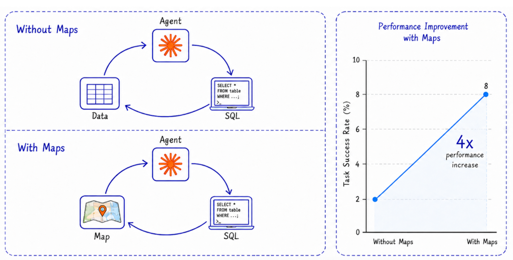

# GeoSQL

Claude, Codex, and GitHub Copilot skill for data scientists and analysts working with geospatial data on PostGIS, BigQuery, Snowflake, and Wherobots.

> Note: No SaaS account needed. Works 100% locally or self-hosted.


> 4x improvement on geospatial tasks with map in the loop.



## Quick Start

With Python (interactive mode):

```bash
pip install geosql && geosql
```

GeoSQL first installs the skill into your detected agent. It then checks whether the optional Dekart CLI is ready and, only when needed, asks before installing or initializing it. The prompt shows the exact commands and defaults to the recommended install option.

After installing, prompt your agent like this:

```
/geosql Show EV charger density along major roads and render a map
```

### Optional: maps and database connections with Dekart

GeoSQL can use [Dekart](https://github.com/dekart-xyz/dekart) so your agent renders maps, reads them back to fix geometry, and connects to PostGIS, BigQuery, Snowflake, or Wherobots.

After a successful install, GeoSQL offers to set up Dekart:

- **Install Dekart CLI** (recommended) runs the `pip` install and `dekart init`. Already installed and configured? GeoSQL detects it and skips ahead.
- **Not now** (or Escape / Ctrl+C / a non-interactive terminal) leaves GeoSQL installed and prints the commands for later:

```bash
python -m pip install dekart
dekart init
```

`dekart init` connects to [Dekart Cloud](https://cloud.dekart.xyz?ref=geosql-github) (no Docker needed), or point it at a local or [self-hosted](https://dekart.xyz/docs/self-hosting/docker/) instance.

## Version telemetry

GeoSQL sends a best-effort version check with its package version and an opaque random installation ID. GeoSQL and Dekart CLI share the ID at `${XDG_CONFIG_HOME:-~/.config}/dekart/installation_id`; deleting that file resets it. Set `DO_NOT_TRACK=1` (or `DNT=1`) to disable the version check before an ID is created. CI sends a reserved non-persisted test ID.

## Example prompts to try in your agent:

Real estate analysis:
```
/geosql Show buildings with low school accessibility in Ottawa, render as a map
```
Site selection:
```
/geosql Find the top 10 locations for Sporting Goods Store in Seattle based on POI co-location and distance to the nearest competitor. Create a map.
```
EV charging infrastructure:
```
/geosql create map EV charger density along major Romanian roads, highlighting how many charging stations are within 5 km of each motorway, trunk, or primary road segment.
```

## How it works

GeoSQL runs an agent loop with a map in it.

1. **Discovery.** The skill explores your warehouse metadata (tables, columns, types) instead of guessing schemas. Works with Overture Maps shares on BigQuery and Snowflake, and your private tables on PostGIS, BigQuery, Snowflake, or Wherobots.
2. **SQL.** The agent writes spatial SQL using the right functions for your engine (`ST_INTERSECTS`, `ST_DISTANCE`, H3, bbox overlap for partition pruning, and so on).
3. **Cost check.** On BigQuery, every query is dry-run first to estimate bytes scanned. A 10 GiB billing cap is enforced by default. Over-budget queries get rewritten cheaper (tighter bbox, lower H3 resolution, more filters) instead of executed.
4. **Geometry validation.** The agent computes total area (polygons) or total length (lines) as a sanity check, and cross-checks against domain knowledge.
5. **Map feedback.** When available, the agent renders the result through Dekart, looks at the rendered image, and corrects geometry mistakes the text-only loop would miss. This is the loop that gets the 4x improvement.

The skill uses your local CLI authentication (`bq`, `snow`, `dekart`), so warehouse credentials never go to the agent.

## Benchmarks

GeoSQL ships with a reproducible eval suite under `evals/`. Each case asserts specific behaviors (cost guardrails, validation steps, correct result), not just "did the agent answer."

Current results on the included suite:

| Case | Assertions | Pass rate |
| --- | --- | --- |
| `london-boroughs` | 4 | 100% |
| `berlin-create-map` | 3 | 100% |
| `paris-boundaries` | 1 | 100% |
| **Total** | **8** | **100%** |

Average: 3,085 tokens per turn, 72 s duration per turn.

The **4x improvement** chart above compares the same task set with and without the map-in-loop step. Without maps, the agent's text-only validation misses geometry-class errors (mistaking a neighborhood polygon for a metro-area perimeter, double-counting overlapping features, picking the wrong join key on coordinate-reference systems). Adding the rendered map as a tool call lets the agent see those mistakes and self-correct.

Run the suite yourself:

```bash
python evals/run.py
```

See `evals/RUNBOOK.md` for setup and how to add new cases. PRs with new evals welcome.
